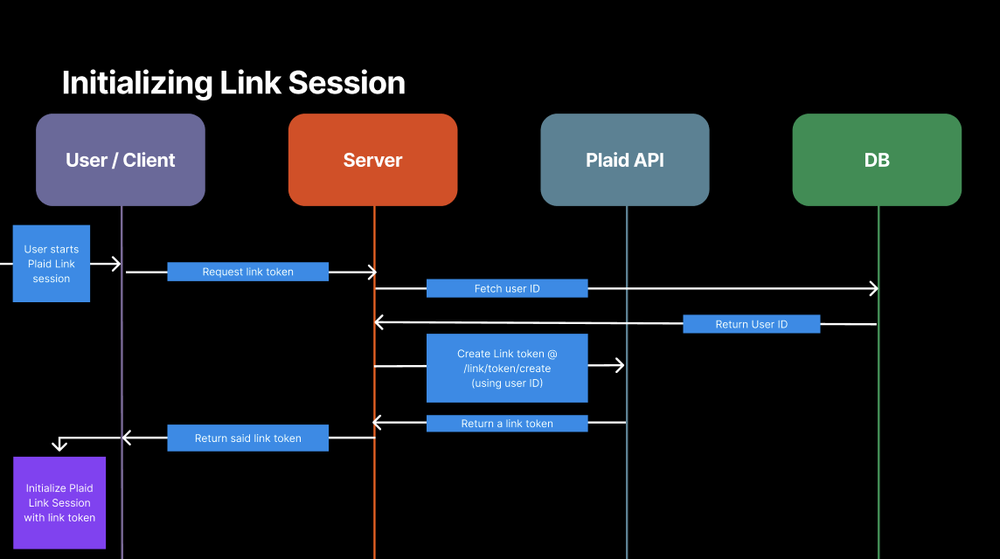
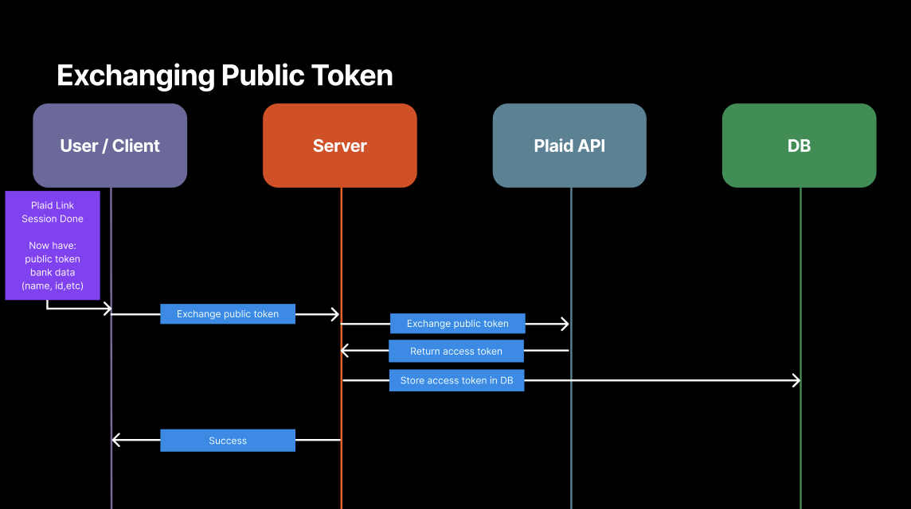
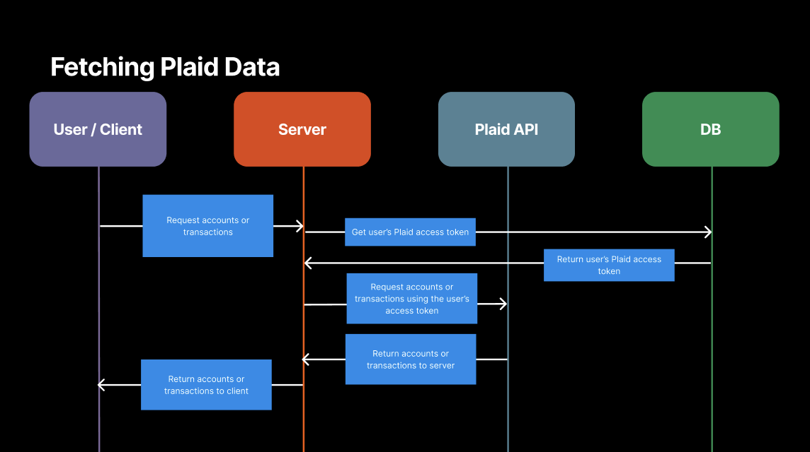

## Plaid-ish Workshop App

A minimal full‑stack demo that incorporates Plaid. See recent transactions, net income over the last month, account balances, and some of the edge cases Plaid can create in your apps.

This workshop will be a walkthrough of a reference design. The focus is on how the pieces fit together: the architecture and the integration points with Plaid.

### Why Plaid‑ish?
- Use realistic data flows to reason about product ideas in personal finance, lending, or budgeting.
- Show a clean separation between client/auth, API, Plaid integration, and persistence.
- Keep infra light so we can focus on the integration: CSV files instead of a full database.

### Architecture at a glance
- Client (Vite + React)
  - Auth via Auth0; acquires an access token for API calls.
  - Renders a simple dashboard for accounts and a monthly in/out summary.
- Server (Express)
  - CORS + JSON + health check.
  - Auth middleware with Auth0 JWT validation, then enriches the request with a `userRecord`.
  - Routes for Plaid flows and webhook ingestion.
  - CSV‑backed persistence for users, items, accounts, transactions, and webhook logs. ( yes, yes, I know not a real DB but we all have our opinions on DB providers so this felt like the safest bet lol )

### Architecture Overview

#### 1) Initialize Plaid Link Session

- **What happens**: Client asks Server for a Link token → Server creates a token with Plaid → returns token → Client opens Link.
- **Code to explore/implement live**:
  - Server route: `server/src/routes/plaid.ts` → `POST /plaid/link/token/create`
  - Plaid wrapper: `server/src/plaid/PlaidClient.ts` → `createLinkToken`
  - Client: `client/src/components/Dashboard.tsx` → `createLink`
- **Docs**:
  - Link token flow: https://plaid.com/docs/link/token-flow/
  - API: https://plaid.com/docs/api/tokens/#linktokencreate
  - Link Web SDK: https://plaid.com/docs/link/web/

#### 2) Exchange Public Token for Access Token

- **What happens**: After Link success the client receives a `public_token` → Server exchanges it with Plaid for an `access_token` → Server stores token for the user.
- **Code to explore/implement live**:
  - Server route: `server/src/routes/plaid.ts` → `POST /plaid/item/public_token/exchange`
  - Plaid wrapper: `server/src/plaid/PlaidClient.ts` → `exchangePublicToken`
  - Persistence: `server/src/db/csvDb.ts` → `createPlaidItem`
- **Docs**:
  - API: https://plaid.com/docs/api/tokens/#itempublic_tokenexchange

#### 3) Fetch Accounts and Transactions

- **What happens**: Client requests accounts/transactions → Server looks up the user’s `access_token` → Server calls Plaid and returns mapped data to the client.
- **Code to explore/implement live**:
  - Server routes: `GET /plaid/accounts`, `GET /plaid/transactions`, `GET /plaid/summary` in `server/src/routes/plaid.ts`
  - Plaid wrapper: `server/src/plaid/PlaidClient.ts` → `getItem`, `getAccounts`, `getTransactions`
  - Client data load: `client/src/components/Dashboard.tsx` → `refresh`
- **Docs**:
  - Accounts Get: https://plaid.com/docs/api/accounts/#accountsget
  - Transactions Get: https://plaid.com/docs/api/products/transactions/#transactionsget
  - Item Get: https://plaid.com/docs/api/items/#itemget

### Environment Variables
- Frontend
  - VITE_API_BASE_URL
    - API Route to prepend to requests
  - VITE_AUTH0_DOMAIN
  - VITE_AUTH0_CLIENT_ID
  - VITE_AUTH0_AUDIENCE
- Backend
  - PLAID_BASE_URL
  - PLAID_CLIENT_ID
  - PLAID_SECRET
  - AUTH0_DOMAIN
  - AUTH0_AUDIENCE

### Request and auth flow
1. User logs in on the client using Auth0.
2. Client requests include a Bearer token.
3. Server validates JWT (`checkJwt`) and attaches a `userRecord` (`attachUser`).
4. Protected routes (under `/plaid`) use the attached user to perform operations and persist results.

### Plaid integration (server)
- `src/plaid/PlaidClient.ts`
  - Thin wrapper around Plaid API: `createLinkToken`, `exchangePublicToken`, `getAccounts`, `getTransactions`, `syncTransactions`.
  - Configured via `src/env.ts` with `PLAID_*` variables.
- `src/routes/plaid.ts`
  - `POST /plaid/link/token/create`: creates a Link token for the authenticated user.
  - `POST /plaid/item/public_token/exchange`: exchanges a `public_token` for an `access_token`, persists the item, fetches accounts, and stores them.
  - `GET /plaid/accounts`: returns items with associated accounts for the authenticated user.
  - `GET /plaid/transactions`: scaffold for later—discusses how to fetch or sync and map into local storage.
- `src/routes/webhook.ts`
  - `POST /plaid/webhook`: receives Plaid webhooks and appends to a CSV log for inspection.

### Persistence model (CSV)
- `server/src/db/csvDb.ts` manages files in `server/DB/`:
  - `users.csv`, `plaid_items.csv`, `accounts.csv`, `transactions.csv`, `webhook_logs.csv`.
- Provides utilities to:
  - Initialize CSV files, append and write rows.
  - Find or create users by Auth0 subject.
  - Create Plaid items and add accounts per item.
  - List items + accounts for a user, and append webhook logs.

### Repository map
- `client/`
  - `src/main.tsx` – Auth0 provider wiring from `.env` values
  - `src/App.tsx` – Login/logout + renders `Dashboard`
  - `src/components/Dashboard.tsx` – Authenticated API calls; accounts and transaction summary UI
- `server/`
  - `src/index.ts` – App bootstrap, CORS/JSON, health, route mounting, error handler
  - `src/auth.ts` – JWT validation and request user attachment via CSV store
  - `src/env.ts` – Environment variables (Auth0, Plaid, CORS)
  - `src/routes/plaid.ts` – Link token, token exchange, accounts, transactions scaffold
  - `src/routes/webhook.ts` – Webhook ingestion and logging
  - `src/plaid/PlaidClient.ts` – Plaid API wrapper
  - `src/db/csvDb.ts` – CSV persistence helpers
  - `src/middleware/errorHandler.ts` – Fallback error handling
- `shared/`
  - `src/index.ts` – Shared types: `User`, `Account`, `Transaction`

### Walkthrough agenda
- Architecture tour: client → server → Plaid → CSV store
- Auth and request lifecycle on the server
- Plaid: Link token creation and token exchange
- Persisting items and accounts; reading them back for the dashboard
- Webhooks: receiving, logging, and how to act on events
- Transactions strategy: on‑demand vs sync, mapping and categorization (design discussion)
- Extensibility and production hardening

### Production considerations (discussion points)
- Store Plaid `access_token` securely; consider encryption and key management.
- Replace CSV with a real database and a proper schema with migrations.
- Verify webhook signatures and handle retries/idempotency.
- Rate limits, pagination/sync cursors, and backfills.
- Observability: structured logs and metrics for Plaid calls and webhook processing.
- Frontend: integrate Plaid Link widget; robust error states and retries.

### Run locally (optional)
- Prereq: Node.js 18+
- Env files: create `server/.env` and `client/.env` with Auth0 and Plaid sandbox values.
- Install deps:
  - `cd server && npm install`
  - `cd ../client && npm install`
- Start:
  - Server: `cd server && npm run dev` → http://localhost:4000
    - I made a simple set of scripts for production credentials so command is `npm run prod`
  - Client: `cd client && npm run dev` → http://localhost:3000
- Health check: `GET /health` → `{ ok: true }`
